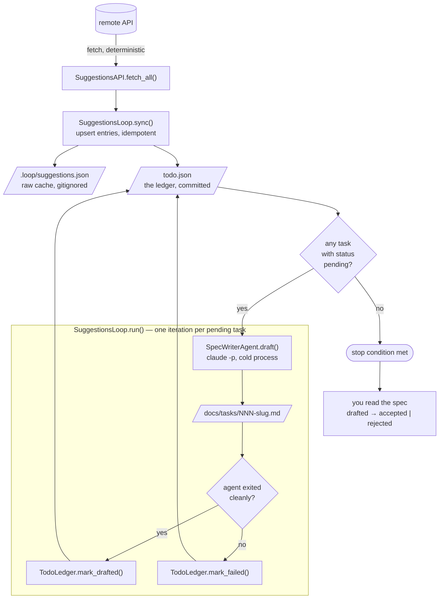
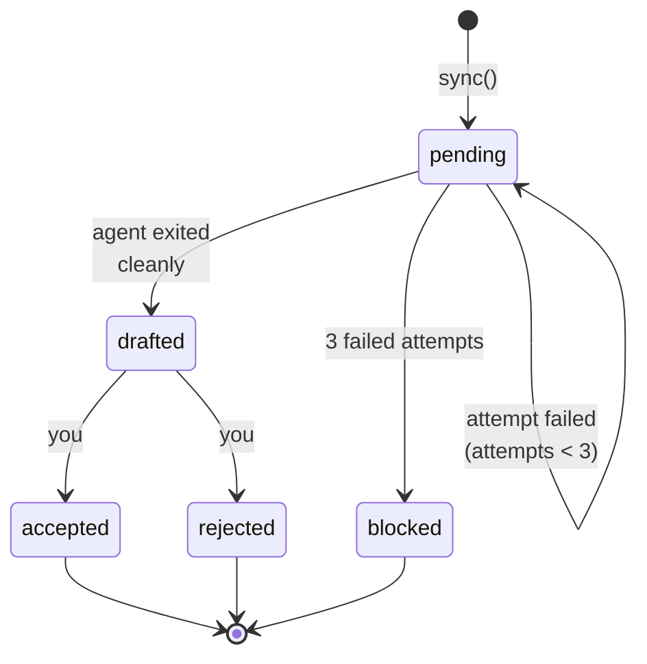

# LOOP.md — the suggestions → task-spec loop

Turns user suggestions from the remote API into structured, implementation-ready task
specs. Run instructions: [README.md](README.md).

**Scope of v1:** writes task descriptions only. Never implements anything, never touches
`src/momentum/`, never opens a PR. No MCP connections.

---

## 1. The six parts of the loop

| Part               | Here                                                                          |
| ------------------ | ----------------------------------------------------------------------------- |
| **Trigger**        | `python -m ai_automation.suggestions_loop run`, by hand (later: cron)         |
| **External state** | `todo.json` — a machine-owned ledger. State lives in files, never in a session |
| **Work unit**      | one suggestion → one `docs/tasks/NNN-slug.md` spec                            |
| **Worker**         | a headless `claude -p --agent task-spec-writer` process, one per suggestion   |
| **Verifier**       | you — every drafted spec is reviewed by hand, accepted or rejected            |
| **Stop condition** | no tasks in `todo.json` with status `pending`                                 |

Three design rules:

1. **Deterministic work goes in Python, agentic work goes in agents.** Fetching
   suggestions and appending ledger entries has exactly one correct output — an agent is
   the wrong tool for it. The agent's only job is judgment: reading the codebase and
   writing a good spec.
2. **The worker does not grade its own homework.** The spec-writer agent never decides
   its own output is acceptable and never edits `todo.json`. It can only report whether
   it exited cleanly; a task only reaches `drafted` if it did. Whether the spec is good
   is a human call.
3. **One package, many commands; one owner per concern.** All deterministic work lives
   in [suggestions_loop/](suggestions_loop/), driven by subcommands. `TodoLedger` is the
   only thing that opens the ledger; the CLI is a thin translation of argv into one
   method call.

Failure modes this guards against:

- _Vague success criteria_ → the stop condition is a JSON query, not a judgment call.
- _Context rot_ → each suggestion gets a cold `claude -p` process; spec #7 has exactly as
  much context as spec #1.
- _Infinite retry_ → `attempts` tracked per task; 3 failures parks it as `blocked`.
- _Comprehension debt_ → the loop stops at `drafted`; a human flips `accepted`/`rejected`.

---

## 2. Architecture



**Idempotency key** is the remote suggestion `id`. Re-running the loop never duplicates
an entry and never re-drafts an already-drafted spec.

### Status flow



Only `pending` tasks are picked up. `rejected` keeps a bad/duplicate idea out of future
runs. `blocked` means the loop gave up — read `last_error`.

---

## 3. The ledger: `todo.json`

JSON, not CSV, because entries carry nested/nullable fields (`source`, `drafted_at`,
`last_error`). Written only by `TodoLedger`; `indent=2` and sorted by `id` for readable
diffs and hand-editing.

```json
{
  "version": 1,
  "tasks": [
    {
      "id": 42,
      "status": "drafted",
      "title": "Reorder measurement FSM steps and add a confirmation screen",
      "spec": "docs/tasks/042-pomenyat-poryadok-sbora-infy.md",
      "source": {
        "user_full_name": "Иван Петров",
        "created_at": "2026-07-28T11:04:12Z",
        "request_text": "Поменять порядок сбора инфы для замеров…"
      },
      "synced_at": "2026-08-05T09:00:00Z",
      "drafted_at": "2026-08-05T09:03:41Z",
      "attempts": 1,
      "last_error": null
    }
  ]
}
```

| Field        | Owner                                | Meaning                                                                   |
| ------------ | ------------------------------------ | ------------------------------------------------------------------------- |
| `id`         | `sync`                               | remote suggestion id — the idempotency key, never changes                 |
| `status`     | `sync` (initial), `mark_*`, **you**  | see status flow above                                                     |
| `title`      | `sync` (provisional), `mark_drafted` | Russian truncation at first, replaced by the spec's own English `# Title` |
| `spec`       | `sync`                               | repo-relative target path, derived from id + transliterated slug          |
| `source`     | `sync`                               | the original record, so specs stay auditable without hitting the API      |
| `attempts`   | `mark_failed`                        | drives the `blocked` transition                                           |
| `last_error` | `mark_failed`                        | why the most recent attempt failed                                        |

`source.request_text` is copied into the ledger so the worker never depends on the API
being up twice; `.loop/suggestions.json` stays a pure debugging artifact.

---

## 4. The worker

`.claude/agents/task-spec-writer.md` is the only agentic step. Given a suggestion id,
the raw Russian text, and one target path, it writes one markdown file with a fixed set
of sections.

- **Tools:** `Read, Grep, Glob, Write`, enforced again by `--allowed-tools`. It
  structurally cannot run commands, edit source, or touch the ledger.
- **Fixed section list:** every spec uses the same headings, so specs are easy to review
  at a glance.
- Prompt pushes it to *investigate first* — a spec naming real files/functions beats one
  that says "the measurement handler".

---

## 5. The reviewer

The loop only reports whether the agent process exited cleanly (`drafted`). Whether the
spec is actually good — real paths, sane scope, no placeholder text — is a human call:
flip to `accepted` if ready to implement, `rejected` if not. Either way the entry stays
in the ledger so it's never resurfaced.

---

## 6. The bounds

| Bound                   | Default      | Why                                                                                                                                        |
| ----------------------- | ------------ | ------------------------------------------------------------------------------------------------------------------------------------------ |
| `--max-tasks`           | 5            | A first run against a big backlog would cost real money before you've seen a single spec. Raise it once you trust the output.              |
| `--budget-usd`          | 1.50         | Per-spec ceiling. An agent stuck in a grep loop stops instead of burning the budget.                                                        |
| `MAX_ATTEMPTS`          | 3            | On `TodoLedger`. A task whose agent run keeps failing is parked as `blocked`, not retried forever.                                          |
| `--allowed-tools`       | read + Write | The worker structurally cannot run commands, edit source, or touch the ledger.                                                             |
| Failure keeps `pending` | —            | Until attempts run out. Nothing is silently lost, nothing is falsely marked done.                                                          |

---

## 7. The interactive twin

`/suggestions-loop` (`.claude/commands/suggestions-loop.md`) drives the same commands and
state from inside a session, so you can watch and course-correct.

---

## 8. Where this goes next

1. **Scheduling.** `run` is already cron-ready. Add a daily spend ceiling before you do it.
2. **An automated review pass.** Advisory only — a human still decides `accepted` vs
   `rejected`. Roughly doubles token cost per task; wait for evidence it's needed.
3. **Duplicate clustering.** Several users reporting the same thing currently produce
   several entries; handle by hand (`rejected`) until volume justifies an agent, since
   clustering breaks the clean id-based idempotency.
4. **Closing the remote loop.** `PATCH` the suggestion's status to `done` when its task
   is accepted — needs a write endpoint.
5. **An implementation loop.** A second loop that reads `accepted` specs and writes code
   on a worktree branch. Needs real verification (ruff + a test suite) before it's safe.
6. **Human-in-the-loop instead of `max_tasks`.** Prompt before every next task rather
   than capping by count.

---

## 9. Sources

**Official**

- [Loop engineering: Getting started with loops](https://claude.com/blog/getting-started-with-loops) — Anthropic. The loop taxonomy (turn-based / goal-based / time-based / proactive), stop conditions, and the pitfalls listed in §1.
- [How the agent loop works](https://code.claude.com/docs/en/agent-sdk/agent-loop) — Claude Code docs. The gather-context → act → verify → repeat cycle.
- [Claude Code headless mode](https://code.claude.com/docs/en/headless) — the `claude -p` flags `SpecWriterAgent` shells out with.
- [Subagents](https://code.claude.com/docs/en/sub-agents) — the `.claude/agents/*.md` frontmatter format used in §4.
- [Slash commands](https://code.claude.com/docs/en/slash-commands) — the `.claude/commands/*.md` format used in §7.

**Community**

- [Loop Engineering](https://addyosmani.com/blog/loop-engineering/) — Addy Osmani. Source of the five components (automations, worktrees, skills, connectors, sub-agents), the "external persistence because models forget between runs" argument behind `todo.json`, and the three failure modes: verification burden, comprehension debt, cognitive surrender.
- [The Definitive Guide to Loop Engineering in Claude Code and Codex](https://www.developersdigest.tech/blog/loop-engineering-definitive-guide) — Developers Digest. `/goal` vs `/loop` vs `/schedule`, turn caps, and the "the worker does not grade its own homework" framing behind Rule 2.
- [Loop Engineering in Claude Code](https://uxplanet.org/loop-engineering-in-claude-code-a36e3b1ca589) — Nick Babich, UX Planet. The prompt-engineering → loop-engineering shift.
- [Loop Engineering: Build Agent Loops in Claude Code](https://www.kunalganglani.com/blog/loop-engineering-agent-loops) — Kunal Ganglani. Persistent skills/hooks/instructions as the substrate for self-correcting loops.
- [Loop Engineering — Building Autonomous Loops with Claude Code](https://dev.classmethod.jp/en/articles/loop-engineering-claude-code-autonomous/) — DevelopersIO.
- [Beyond One-Shot Prompts: 5 Claude Code Workflow Patterns](https://www.mindstudio.ai/blog/claude-code-agentic-workflow-patterns) — MindStudio. Sub-agents as context isolation, which is why each spec gets its own cold process.
